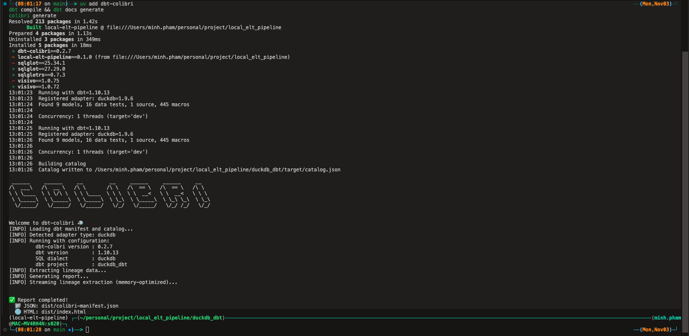
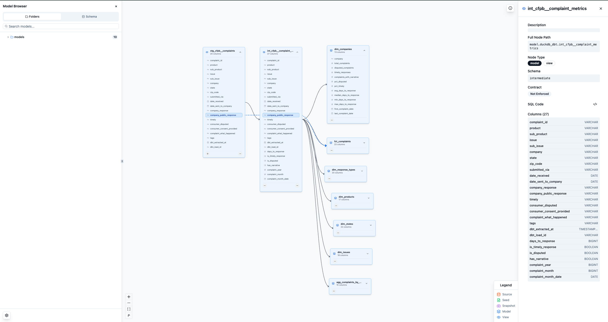

# DBT Models Documentation

## 1. Overview


This project uses dbt (data build tool) to transform raw CFPB (Consumer Financial Protection Bureau) complaint data into structured, analysis-ready models. The transformation pipeline follows the medallion architecture pattern with three distinct layers: staging, intermediate, and marts.

## 2. Project Structure

```text
duckdb_dbt/
├── models/
│   ├── staging/          # Light transformations from raw data
│   │   └── cfpb/
│   │       ├── _cfpb__sources.yml
│   │       ├── _cfpb__models.yml
│   │       └── stg_cfpb__complaints.sql
│   ├── intermediate/     # Business logic and enrichment
│   │   └── cfpb/
│   │       └── int_cfpb__complaint_metrics.sql
│   └── marts/           # Final consumption-ready tables
│       └── core/
│           ├── _core__models.yml
│           ├── fct_complaints.sql
│           ├── dim_companies.sql
│           ├── dim_products.sql
│           ├── dim_issues.sql
│           ├── dim_states.sql
│           ├── dim_response_types.sql
│           └── agg_complaints_by_month.sql
└── dbt_project.yml
```

## 3. Schema Diagram

```text
┌─────────────────────────────────────────────────────────────────────┐
│                         DATA FLOW ARCHITECTURE                      │
└─────────────────────────────────────────────────────────────────────┘

┌─────────────────┐
│  Raw Layer      │
│  (via dlt)      │
└────────┬────────┘
         │
         │ source()
         ▼
┌─────────────────────────┐
│   Staging Layer (VIEW)  │
│  stg_cfpb__complaints   │
└──────────┬──────────────┘
           │
           │ ref()
           ▼
┌─────────────────────────────┐
│  Intermediate Layer (VIEW)  │
│ int_cfpb__complaint_metrics │
│  • Calculated metrics       │
│  • Boolean flags            │
│  • Temporal dimensions      │
└──────────┬──────────────────┘
           │
           │ ref()
           ▼
┌───────────────────────────────────────────────────────────────┐
│                    Marts Layer (TABLES)                       │
├───────────────────────────────────────────────────────────────┤
│                                                               │
│  ┌──────────────────┐         ┌──────────────────┐            │
│  │ fct_complaints   │         │  dim_companies   │            │
│  │ • Grain: 1 row   │         │  • Grain: 1 row  │            │
│  │   per complaint  │         │    per company   │            │
│  │ • All dimensions │         │  • Aggregated    │            │
│  │ • All metrics    │         │    stats         │            │
│  └──────────────────┘         └──────────────────┘            │
│                                                               │
│  ┌──────────────────┐         ┌──────────────────┐            │
│  │  dim_products    │         │   dim_issues     │            │
│  │ • Grain: 1 row   │         │  • Grain: 1 row  │            │
│  │   per product/   │         │    per issue/    │            │
│  │   sub-product    │         │    sub-issue     │            │
│  │ • Hierarchy      │         │  • Hierarchy     │            │
│  │   support        │         │    support       │            │
│  └──────────────────┘         └──────────────────┘            │
│                                                               │
│  ┌──────────────────┐         ┌──────────────────┐            │
│  │   dim_states     │         │dim_response_types│            │
│  │ • Grain: 1 row   │         │  • Grain: 1 row  │            │
│  │   per state      │         │    per response  │            │
│  │ • Geographic     │         │    type          │            │
│  │   analysis       │         │  • Outcome stats │            │
│  └──────────────────┘         └──────────────────┘            │
│                                                               │
│  ┌──────────────────────────────────────────────┐             │
│  │      agg_complaints_by_month                 │             │
│  │      • Grain: 1 row per month                │             │
│  │      • Time-series metrics                   │             │
│  │      • Trend analysis                        │             │
│  └──────────────────────────────────────────────┘             │
│                                                               │
└───────────────────────────────────────────────────────────────┘
```

### 3.1 Model Relationships

```text
raw.cfpb_complaints
    ↓
stg_cfpb__complaints
    ↓
int_cfpb__complaint_metrics
    ├──→ fct_complaints
    ├──→ dim_companies
    ├──→ dim_products
    ├──→ dim_issues
    ├──→ dim_states
    ├──→ dim_response_types
    └──→ agg_complaints_by_month
```

## 4. Architecture

### 4.1 Materialization Strategy

The project uses different materialization strategies based on the layer:

- **Staging models**: Materialized as `view` (schema: `staging`)
- **Intermediate models**: Materialized as `view` (schema: `intermediate`)
- **Marts models**: Materialized as `table` (schema: `marts`)

This approach balances query performance with storage efficiency, keeping lightweight transformations as views while materializing final analytical models as tables for optimal query speed.

## 5. Data Models

### 5.1 Layer 1: Staging

#### `stg_cfpb__complaints`

**Location**: `models/staging/cfpb/stg_cfpb__complaints.sql`
**Materialization**: View
**Source**: `raw.cfpb_complaints` (loaded via dlt)

Light transformations on raw CFPB complaints data with cleaned and standardized column names.

**Key Transformations**:

- Converts date fields to proper date types
- Renames dlt metadata columns for consistency
- Standardizes column naming conventions

**Columns**:

- `complaint_id` - Unique identifier (tested for uniqueness and not null)
- `product`, `sub_product` - Financial product categorization
- `issue`, `sub_issue` - Complaint categorization
- `company` - Company name
- `state`, `zip_code` - Consumer location
- `submitted_via` - Submission channel
- `date_received`, `date_sent_to_company` - Timeline dates
- `company_response`, `company_public_response` - Response details
- `timely`, `consumer_disputed`, `consumer_consent_provided` - Status flags
- `complaint_what_happened` - Complaint narrative
- `tags` - Additional categorization
- `dbt_extracted_at`, `dbt_load_id` - Load metadata

### 5.2 Layer 2: Intermediate

#### `int_cfpb__complaint_metrics`

**Location**: `models/intermediate/cfpb/int_cfpb__complaint_metrics.sql`
**Materialization**: View
**Dependency**: `stg_cfpb__complaints`

Enriches staged complaints with calculated metrics and normalized boolean flags.

**Calculated Fields**:

- `days_to_response` - Days between complaint receipt and company response
- `is_timely_response` - Boolean flag (converted from 'Yes'/'No')
- `is_disputed` - Boolean flag for consumer disputes
- `has_narrative` - Flag indicating presence of complaint text
- `complaint_year`, `complaint_month` - Temporal dimensions
- `complaint_month_date` - First day of month for time-series analysis

### 5.3 Layer 3: Marts (Core)

#### `fct_complaints`

**Location**: `models/marts/core/fct_complaints.sql`
**Materialization**: Table
**Dependency**: `int_cfpb__complaint_metrics`

Fact table containing detailed complaint records with all dimensions and calculated metrics. This is the primary table for detailed complaint-level analysis.

**Use Cases**:

- Individual complaint investigation
- Product and issue analysis
- Geographic analysis by state/zip
- Response time analysis
- Dispute pattern analysis

**Primary Key**: `complaint_id` (unique, not null)

#### `dim_companies`

**Location**: `models/marts/core/dim_companies.sql`
**Materialization**: Table
**Dependency**: `int_cfpb__complaint_metrics`

Dimension table aggregating complaint statistics at the company level.

**Metrics Included**:

- `total_complaints` - Total number of complaints
- `disputed_complaints` - Count of disputed complaints
- `timely_responses` - Count of timely responses
- `complaints_with_narrative` - Complaints with detailed narratives
- `pct_disputed` - Percentage of complaints disputed
- `pct_timely` - Percentage of timely responses
- `avg_days_to_response` - Average response time
- `median_days_to_response` - Median response time
- `min_days_to_response`, `max_days_to_response` - Response time range
- `first_complaint_date`, `last_complaint_date` - Activity date range

**Use Cases**:

- Company performance benchmarking
- Identifying problematic companies
- Company ranking and comparison
- Regulatory compliance monitoring

**Primary Key**: `company` (unique, not null)
**Sorting**: Ordered by `total_complaints` descending

#### `agg_complaints_by_month`

**Location**: `models/marts/core/agg_complaints_by_month.sql`
**Materialization**: Table
**Dependency**: `int_cfpb__complaint_metrics`

Monthly aggregated complaint metrics for trend analysis and time-series reporting.

**Metrics Included**:

- `year`, `month` - Time dimensions
- `total_complaints` - Monthly complaint volume
- `unique_companies` - Distinct companies with complaints
- `unique_products` - Distinct products complained about
- `unique_states` - Geographic spread
- `timely_responses`, `pct_timely` - Response timeliness
- `disputed_complaints`, `pct_disputed` - Dispute rates
- `complaints_with_narrative`, `pct_with_narrative` - Narrative presence
- `avg_days_to_response`, `median_days_to_response` - Response time trends

**Use Cases**:

- Trend analysis over time
- Seasonal pattern detection
- Forecasting and prediction
- Performance tracking
- Dashboard and reporting

**Primary Key**: `complaint_month_date` (unique, not null)
**Sorting**: Ordered by `complaint_month_date` descending (most recent first)

#### `dim_products`

**Location**: `models/marts/core/dim_products.sql`
**Materialization**: Table
**Dependency**: `int_cfpb__complaint_metrics`

Product dimension table with hierarchical product/sub-product statistics. Includes both detailed sub-product rows and rolled-up product totals (indicated by null sub_product).

**Metrics Included**:

- `product`, `sub_product` - Product hierarchy (sub_product is null for rollup rows)
- `total_complaints` - Total complaints for this product/sub-product
- `unique_companies` - Number of distinct companies
- `unique_states` - Geographic spread
- `timely_responses`, `pct_timely` - Response timeliness metrics
- `disputed_complaints`, `pct_disputed` - Dispute statistics
- `complaints_with_narrative`, `pct_with_narrative` - Narrative presence
- `avg_days_to_response`, `median_days_to_response` - Response time metrics
- `first_complaint_date`, `last_complaint_date` - Activity date range
- `most_common_issue` - Top issue for this product
- `most_complained_company` - Company with most complaints for this product

**Use Cases**:

- Product performance analysis
- Identifying problematic product categories
- Product hierarchy analysis (category → sub-category)
- Cross-product comparison

**Primary Key**: Composite `(product, sub_product)`
**Sorting**: Ordered by `product`, `sub_product` (nulls first for rollups)

#### `dim_issues`

**Location**: `models/marts/core/dim_issues.sql`
**Materialization**: Table
**Dependency**: `int_cfpb__complaint_metrics`

Issue dimension table with hierarchical issue/sub-issue statistics. Includes both detailed sub-issue rows and rolled-up issue totals (indicated by null sub_issue).

**Metrics Included**:

- `issue`, `sub_issue` - Issue hierarchy (sub_issue is null for rollup rows)
- `total_complaints` - Total complaints for this issue/sub-issue
- `unique_companies` - Number of distinct companies
- `unique_products` - Number of distinct products
- `unique_states` - Geographic spread
- `timely_responses`, `pct_timely` - Response timeliness metrics
- `disputed_complaints`, `pct_disputed` - Dispute statistics
- `complaints_with_narrative`, `pct_with_narrative` - Narrative presence
- `avg_days_to_response`, `median_days_to_response` - Response time metrics
- `first_complaint_date`, `last_complaint_date` - Activity date range
- `most_common_product` - Most common product for this issue
- `most_complained_company` - Company with most complaints for this issue

**Use Cases**:

- Issue trend analysis
- Identifying systemic problems
- Issue hierarchy analysis (category → sub-category)
- Cross-issue comparison
- Regulatory focus areas

**Primary Key**: Composite `(issue, sub_issue)`
**Sorting**: Ordered by `issue`, `sub_issue` (nulls first for rollups)

#### `dim_states`

**Location**: `models/marts/core/dim_states.sql`
**Materialization**: Table
**Dependency**: `int_cfpb__complaint_metrics`

Geographic dimension table with state-level complaint statistics and characteristics.

**Metrics Included**:

- `state` - Two-letter state abbreviation
- `total_complaints` - Total complaints from this state
- `unique_companies` - Number of companies complained about
- `unique_products` - Number of products complained about
- `unique_issues` - Number of distinct issues
- `unique_zip_codes` - ZIP code coverage within state
- `timely_responses`, `pct_timely` - Response timeliness metrics
- `disputed_complaints`, `pct_disputed` - Dispute statistics
- `complaints_with_narrative`, `pct_with_narrative` - Narrative presence
- `avg_days_to_response`, `median_days_to_response` - Response time metrics
- `min_days_to_response`, `max_days_to_response` - Response time range
- `first_complaint_date`, `last_complaint_date` - Activity date range
- `most_common_product` - Most complained about product in state
- `most_common_issue` - Most common issue in state
- `most_complained_company` - Company with most complaints in state
- `most_common_submission_method` - Preferred submission channel

**Use Cases**:

- Geographic analysis and heat maps
- State-by-state comparison
- Regional regulatory compliance
- Market analysis by geography
- Consumer behavior patterns by location

**Primary Key**: `state` (unique, not null)
**Sorting**: Ordered by `total_complaints` descending

#### `dim_response_types`

**Location**: `models/marts/core/dim_response_types.sql`
**Materialization**: Table
**Dependency**: `int_cfpb__complaint_metrics`

Company response type dimension analyzing outcomes and patterns by response category.

**Metrics Included**:

- `company_response` - Type of company response
- `total_complaints` - Total complaints with this response type
- `unique_companies` - Companies using this response type
- `unique_products` - Products associated with this response
- `unique_states` - Geographic spread
- `timely_responses`, `pct_timely` - Response timeliness for this type
- `disputed_complaints`, `pct_disputed` - Dispute rates by response type
- `complaints_with_narrative`, `pct_with_narrative` - Narrative presence
- `avg_days_to_response`, `median_days_to_response` - Response time metrics
- `min_days_to_response`, `max_days_to_response` - Response time range
- `first_complaint_date`, `last_complaint_date` - Activity date range
- `most_common_product` - Most common product for this response type
- `most_common_issue` - Most common issue for this response type
- `most_complained_company` - Company most using this response type

**Use Cases**:

- Response outcome analysis
- Company resolution strategy analysis
- Consumer satisfaction patterns
- Resolution effectiveness metrics
- Best practices identification

**Primary Key**: `company_response` (unique, not null)
**Sorting**: Ordered by `total_complaints` descending

## 6. Data Quality

### 6.1 Testing Strategy

The project implements data quality tests at critical points:

**Source Level** (`_cfpb__sources.yml`):

- `complaint_id` - Unique and not null

**Staging Level** (`_cfpb__models.yml`):

- `stg_cfpb__complaints.complaint_id` - Unique and not null

**Marts Level** (`_core__models.yml`):

- `fct_complaints.complaint_id` - Unique and not null
- `dim_companies.company` - Unique and not null
- `dim_products.product` - Not null (composite key with sub_product)
- `dim_issues.issue` - Not null (composite key with sub_issue)
- `dim_states.state` - Unique and not null
- `dim_response_types.company_response` - Unique and not null
- `agg_complaints_by_month.complaint_month_date` - Unique and not null

## 7. Usage

### 7.1 Running dbt

```bash
# Navigate to the dbt project directory
cd duckdb_dbt

# Run all models
dbt run

# Run specific model
dbt run --select stg_cfpb__complaints

# Run all staging models
dbt run --select staging.*

# Run all marts models
dbt run --select marts.*

# Test data quality
dbt test

# Generate and serve documentation
dbt docs generate
dbt docs serve
```

### 7.2 Query Examples

**Top 10 companies by complaint volume**:

```sql
SELECT company, total_complaints, pct_disputed, avg_days_to_response
FROM marts.dim_companies
LIMIT 10;
```

**Monthly complaint trends**:

```sql
SELECT complaint_month_date, total_complaints, pct_timely, avg_days_to_response
FROM marts.agg_complaints_by_month
ORDER BY complaint_month_date;
```

**Product hierarchy analysis** (rollups and detail):

```sql
-- Product-level summary (sub_product is null)
SELECT product, total_complaints, pct_disputed, most_common_issue
FROM marts.dim_products
WHERE sub_product IS NULL
ORDER BY total_complaints DESC;

-- Detailed sub-product breakdown for a specific product
SELECT product, sub_product, total_complaints, pct_timely, avg_days_to_response
FROM marts.dim_products
WHERE product = 'Credit card or prepaid card'
  AND sub_product IS NOT NULL
ORDER BY total_complaints DESC;
```

**Geographic heat map data**:

```sql
SELECT
    state,
    total_complaints,
    pct_disputed,
    most_common_product,
    most_common_issue
FROM marts.dim_states
ORDER BY total_complaints DESC;
```

**Issue trend analysis**:

```sql
-- Top-level issues (sub_issue is null)
SELECT issue, total_complaints, pct_disputed, most_common_product
FROM marts.dim_issues
WHERE sub_issue IS NULL
ORDER BY total_complaints DESC
LIMIT 10;
```

**Response outcome effectiveness**:

```sql
SELECT
    company_response,
    total_complaints,
    pct_timely,
    pct_disputed,
    avg_days_to_response
FROM marts.dim_response_types
ORDER BY pct_disputed DESC;
```

**Complex cross-dimension analysis**:

```sql
-- Complaints by state and product
SELECT
    s.state,
    p.product,
    COUNT(*) as complaint_count,
    AVG(f.days_to_response) as avg_response_days,
    ROUND(100.0 * SUM(CASE WHEN f.is_disputed THEN 1 ELSE 0 END) / COUNT(*), 2) as pct_disputed
FROM marts.fct_complaints f
JOIN marts.dim_states s ON f.state = s.state
JOIN marts.dim_products p ON f.product = p.product AND f.sub_product = p.sub_product
GROUP BY s.state, p.product
ORDER BY complaint_count DESC
LIMIT 20;
```

### 7.3 Generating Lineage Reports with dbt-colibri

dbt-colibri is a powerful tool for generating interactive data lineage reports from your dbt project. It extracts lineage information and creates visual reports showing how data flows through your models.

**Prerequisites**:

Ensure dbt-colibri is installed:

```bash
uv add dbt-colibri
```

**Usage**:

```bash
# Navigate to the dbt project directory
cd duckdb_dbt

# First, compile models and generate dbt documentation
dbt compile && dbt docs generate

# Generate lineage report
colibri generate
```



**Output**:

After running `colibri generate`, you'll find two files in the `dist/` directory:

- **JSON Manifest**: `dist/colibri-manifest.json` - Machine-readable lineage data
- **HTML Report**: `dist/index.html` - Interactive visual lineage report

The tool automatically detects your adapter type (DuckDB in this project) and extracts comprehensive lineage information showing:

- Model dependencies and relationships
- Data flow from sources through staging, intermediate, and marts layers
- Column-level lineage (if available)
- Model metadata and relationships

Open `dist/index.html` in your browser to explore the interactive lineage visualization.



## 8. Configuration

### 8.1 Database Profile

The project uses the `duckdb_dbt` profile (configured in `profiles.yml`). Ensure your profile points to the correct DuckDB database file containing the raw data loaded by dlt.

### 8.2 Custom Schemas

Models are organized into custom schemas:

- `staging.*` � `staging` schema
- `intermediate.*` � `intermediate` schema
- `marts.*` � `marts` schema

## 9. Dependencies

- **dbt-core**: Data transformation framework
- **dbt-duckdb**: DuckDB adapter for dbt
- **dbt-colibri**: Data lineage visualization tool
- **DuckDB**: In-process SQL database
- **dlt**: Data loading tool (upstream dependency)

## 10. Best Practices

1. **Layer Separation**: Keep staging models simple, put business logic in intermediate models, and create consumption-ready models in marts
2. **Materialization**: Use views for transformations, tables for final outputs
3. **Testing**: Always test primary keys and critical business logic
4. **Documentation**: Keep schema YAML files up-to-date with model changes
5. **Naming Conventions**:
   - `stg_<source>__<entity>` for staging models
   - `int_<source>__<description>` for intermediate models
   - `fct_<entity>` for fact tables
   - `dim_<entity>` for dimension tables
   - `agg_<description>` for aggregation tables

## 11. Extending the Models

### 11.1 Adding a New Mart Model

1. Create SQL file in `models/marts/core/`
2. Reference intermediate model: `{{ ref('int_cfpb__complaint_metrics') }}`
3. Add documentation to `_core__models.yml`
4. Add appropriate tests

### 11.2 Adding a New Data Source

1. Define source in `models/staging/<source>/_<source>__sources.yml`
2. Create staging model to clean and rename columns
3. Update intermediate model if needed
4. Create mart models for analytical use cases

## 12. Troubleshooting

**Issue**: Models fail to compile
**Solution**: Ensure dbt is installed and the duckdb_dbt profile is configured correctly

**Issue**: Source not found
**Solution**: Verify raw data has been loaded via dlt and the source schema/table names match

**Issue**: Tests failing
**Solution**: Check data quality in source tables, may need data cleaning in staging layer

## 13. Additional Resources

- [dbt Documentation](https://docs.getdbt.com/)
- [dbt-duckdb Adapter](https://github.com/duckdb/dbt-duckdb)
- [CFPB Complaints Database](https://www.consumerfinance.gov/data-research/consumer-complaints/)
